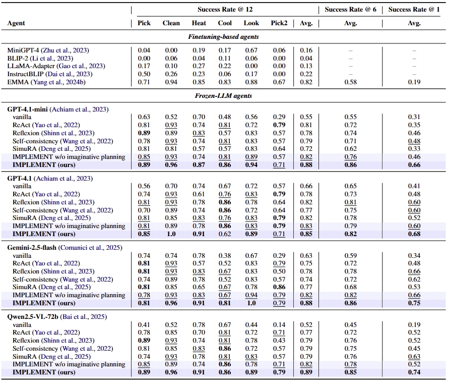

# IMPLEMENT: Model-Based Online Policy Iteration for Embodied LLM Agents

Official implementation of **"Model-Based Online Policy Iteration for Embodied LLM Agents"**.

> **Note**: This is an anonymous repository for the review process.

## Overview

IMPLEMENT is a model-based test-time reasoning framework that enables Large Language Models (LLMs) to perform **imaginative planning** and act as adaptive embodied agents. 

**Key components:**
- **Unified Symbolic World Model**: A single VLM that operates in two modes:
  - **Perception mode** (`[PER]`): Extracts symbolic states from visual observations
  - **Prediction mode** (`[PRE]`): Predicts future states given actions
- **Meta In-Context Learning (MetaICL)**: Test-time adaptation using past trajectories
- **Model-Based Policy Iteration**: LLM and world model co-reasoning for decision refinement

### Framework Overview


*Figure 1: Overview of IMPLEMENT framework. The agent grounds visual observations into symbolic states and imagines action outcomes using a world model. Monte Carlo rollouts guide iterative policy evaluation and refinement.*

## Key Features

- 🎯 **Test-time scaling**: No fine-tuning required for policy LLMs
- 🔄 **Online adaptation**: World model improves via MetaICL during deployment
- 🎲 **Monte Carlo rollouts**: Handles uncertainty in partially observable environments
- 🚀 **Plug-and-play**: Compatible with any LLM (GPT-4, Gemini, Qwen, etc.)

## Installation

### Prerequisites

- Python 3.9 or 3.10
- CUDA 11.8+ (for GPU support)
- 4x NVIDIA A800 or equivalent GPUs (for world model training)
- Linux or MacOS (Windows not officially supported)

### Setup

#### Step 1: Clone Repository

```bash
git clone https://anonymous.4open.science/r/IMPLEMENT-8A7C/
cd IMPLEMENT
```

#### Step 2: Create Environment

```bash
# Create conda environment
conda create -n implement python=3.9
conda activate implement
```

> **Note for MacOS ARM users**: Use `CONDA_SUBDIR=osx-64 conda create -n implement python=3.9`

#### Step 3: Install Dependencies

```bash
# Install core dependencies
pip install -r requirements.txt
```

#### Step 4: Install ALFWorld

ALFWorld is required for both training and evaluation. Follow the [official installation guide](https://github.com/alfworld/alfworld):

```bash
# Install ALFWorld with visual support
pip install alfworld[full]

# Download PDDL files, game files, and pre-trained MaskRCNN detector
# This will be stored in ~/.cache/alfworld/
alfworld-download
```

> **Note**: Use `alfworld[vis]` for visual-only support, or just `alfworld` for text-only version.

#### Step 5: Verify Installation

```bash
# Test ALFWorld installation
python -c "import alfworld; print('ALFWorld installed successfully!')"

# Test IMPLEMENT imports
python -c "from implement import config; print('IMPLEMENT ready!')"
```

#### Step 6: Configure API Keys

Edit `config.py` and set your API credentials:

```python
@dataclass
class LLMConfig:
    api_base_url: str = "YOUR_API_BASE_URL"  # e.g., "https://api.openai.com/v1"
    api_key: str = "YOUR_API_KEY"            # Your OpenAI/Azure API key
    policy_model: str = "gpt-4.1-mini"       # Model to use
```

Alternatively, use environment variables:
```bash
export OPENAI_API_KEY="your-api-key"
```

## Project Structure

```
IMPLEMENT/
├── config.py                      # Configuration file
├── requirements.txt               # Dependencies
├── implement/                     # Core implementation
│   ├── api/                       # FastAPI server
│   ├── policy/                    # Policy iteration
│   ├── world_model/               # Perception & prediction
│   ├── prompts/                   # Prompt templates
│   └── utils/                     # Utilities
└── scripts/                       # Training & evaluation
    ├── collect_data.py
    ├── curate_data.py
    ├── train_world_model.py
    └── evaluate.py
```

## Usage

### 1. Collect Training Data

```bash
python scripts/collect_data.py \
    --alfworld_root /path/to/alfworld \
    --output_dir ./data/raw \
    --batch_size 5 \
    --num_tasks 200
```

### 2. Prepare Training Samples with MetaICL

Prepare training samples with MetaICL conditions (used in paper):

```bash
python scripts/prepare_metaicl_data.py \
    --data_dirs ./data/raw1 ./data/raw2 ./data/raw3 \
    --output_dir ./data/prepared
```

This creates `training_samples.jsonl` with randomly sampled MetaICL conditions.

### 3. Curate Data into Final Training Format

Format the samples with prompts for training:

```bash
python scripts/curate_data.py \
    --input_file ./data/prepared/training_samples_metaicl.jsonl \
    --data_dir ./data/prepared \
    --output_dir ./data/curated
```

This generates:
- `curated_samples_perception.jsonl`: Perception training data
- `curated_samples_prediction.jsonl`: Prediction training data with MetaICL conditions

### 4. Train World Model

Train the unified world model (both perception and prediction modes):

```bash
python scripts/train_world_model.py \
    --data_dir ./data/curated \
    --output_dir ./checkpoints/world_model \
    --num_epochs 3
```

The training script automatically:
- Loads both perception and prediction samples
- Handles `[PER]` and `[PRE]` modes in a unified model
- Applies label masking for efficient training

### 5. Deploy World Model

Install vLLM for efficient model serving:

```bash
pip install vllm
```

Deploy the **unified world model** (handles both perception and prediction):

```bash
python -m vllm.entrypoints.openai.api_server \
    --model ./checkpoints/world_model \
    --served-model-name wm_metaicl \
    --tensor-parallel-size 4 \
    --trust-remote-code \
    --port 8002 \
    --gpu-memory-utilization 0.85 \
    --enable-prefix-caching True \
    --max-num-batched-tokens 8192
```

**Important parameters**:
- `--model`: Path to your trained world model checkpoint
- `--served-model-name wm_metaicl`: Model name for API calls (must match `config.py`)
- `--tensor-parallel-size 4`: Uses 4 GPUs in parallel
- `--gpu-memory-utilization 0.85`: Uses 85% of GPU memory
- `--enable-prefix-caching`: Enables KV cache sharing for faster inference
- `--max-num-batched-tokens 8192`: Maximum tokens per batch

> **Note**: This deploys a **single unified world model** that handles both perception (via `[PER]` token) and prediction (via `[PRE]` token) modes, as described in Section 3.2 of the paper.

### 6. Start API Server

```bash
python implement/api/server.py
```

### 7. Run Evaluation

```bash
python scripts/evaluate.py \
    --alfworld_root /path/to/alfworld \
    --api_url http://localhost:30972 \
    --model gpt-4.1-mini \
    --output_dir ./results
```

### 8. (Optional) Extract MetaICL Conditions from Evaluation

After running evaluation, you can extract conditions for future test-time adaptation:

```bash
python scripts/extract_metaicl_conditions.py \
    --eval_dir ./results \
    --output_dir ./data/test_conditions
```

This extracts `object_lists.json` and `failed_actions.json` from evaluation trajectories, which can be used during inference for better adaptation.

## Hyperparameters (from Paper)

Key hyperparameters used in the paper:

- **World Model**: Qwen2.5-VL-7B with LoRA (r=16, α=16)
- **Training**: 3 epochs, lr=2e-5, batch size=4×4 (gradient accumulation)
- **Policy Iteration**: Max 5 rounds per step, 10 MC samples
- **Prediction Temperature**: 1.0 for Monte Carlo rollouts
- **MetaICL**: Max 15 historical observations + 15 failed actions

All hyperparameters can be configured in `config.py`.

## Results

### Comparison with Baselines

IMPLEMENT consistently outperforms finetuning-based and test-time scaling approaches across multiple policy backbones:



*Table 1: Performance comparison on ALFWorld. IMPLEMENT achieves the best results across different policy backbones and evaluation budgets.*

### Ablation Studies


*Figure 2: Ablation studies showing the effects of MetaICL and imaginative planning on success rate, planning efficiency, and reliability.*

**Key findings:**
- Both MetaICL and imaginative planning contribute to performance gains
- Improvements are most pronounced in early trials (efficient learning)
- Temperature=1.0 provides optimal balance for Monte Carlo rollouts

## Configuration Details

### LLM Configuration
- Set your API endpoint and key in `config.py`
- Supports OpenAI, Azure OpenAI, or compatible APIs
- Default model: GPT-4.1-mini (can be changed to GPT-4.1, Gemini, etc.)

### World Model Configuration
- **Unified model**: Single Qwen2.5-VL-7B fine-tuned with LoRA
- **Two modes**: Perception (`[PER]`) and Prediction (`[PRE]`)
- Deployed via vLLM for efficient inference
- Single deployment serves both perception and prediction

### Policy Configuration
- Max interaction rounds: 5 per environment step
- Max episode steps: 30
- Batch size: 5 (for parallel environments)

## Troubleshooting

### CUDA out of memory
- Reduce `per_device_train_batch_size` in `config.py`
- Increase `gradient_accumulation_steps`

### vLLM deployment fails
- Check GPU availability: `nvidia-smi`
- Ensure sufficient GPU memory (>40GB per GPU, A800 80GB recommended)

### API connection errors
- Verify API server: `curl http://localhost:30972/health`
- Check world model: `curl http://localhost:8002/health`

### ALFWorld environment errors
- Ensure ALFWorld is installed: `python -c "import alfworld"`
- Download data: `alfworld-download`
- Check ALFWorld data: `ls ~/.cache/alfworld/`
- For more help, see [ALFWorld GitHub](https://github.com/alfworld/alfworld)

### World model training issues
- Ensure sufficient GPU memory (4x A800 or equivalent)
- Check CUDA compatibility: `nvidia-smi`
- Verify model cache directory exists and is writable

## Code Organization

- **`implement/api/`**: FastAPI server for policy and perception endpoints
- **`implement/policy/`**: Model-based policy iteration algorithm
- **`implement/world_model/`**: Unified world model with perception and prediction modes
  - Uses `[PER]` token for perception mode (extracts states from images)
  - Uses `[PRE]` token for prediction mode (predicts future states)
- **`implement/prompts/`**: All prompt templates (aligned with paper)
- **`implement/utils/`**: State representation and LLM utilities
- **`scripts/`**: Data collection, training, and evaluation scripts

> **Note**: The world model is a **single unified model** that operates in two modes, not two separate models. This design is described in Section 3.2 of the paper.

## Citation

If you find this work useful, please cite our paper:

```bibtex
@article{anonymous2025implement,
  title={Model-Based Online Policy Iteration for Embodied LLM Agents},
  author={Anonymous},
  journal={Under Review},
  year={2025}
}
```

## Acknowledgments

- [ALFWorld](https://github.com/alfworld/alfworld) for the embodied environment
- [Qwen2.5-VL](https://github.com/QwenLM/Qwen2.5-VL) for the vision-language model
- [vLLM](https://github.com/vllm-project/vllm) for efficient model serving

## Anonymous Repository

This is an anonymous repository for the review process. Full details will be released upon acceptance.

Repository: https://anonymous.4open.science/r/IMPLEMENT-8A7C/
